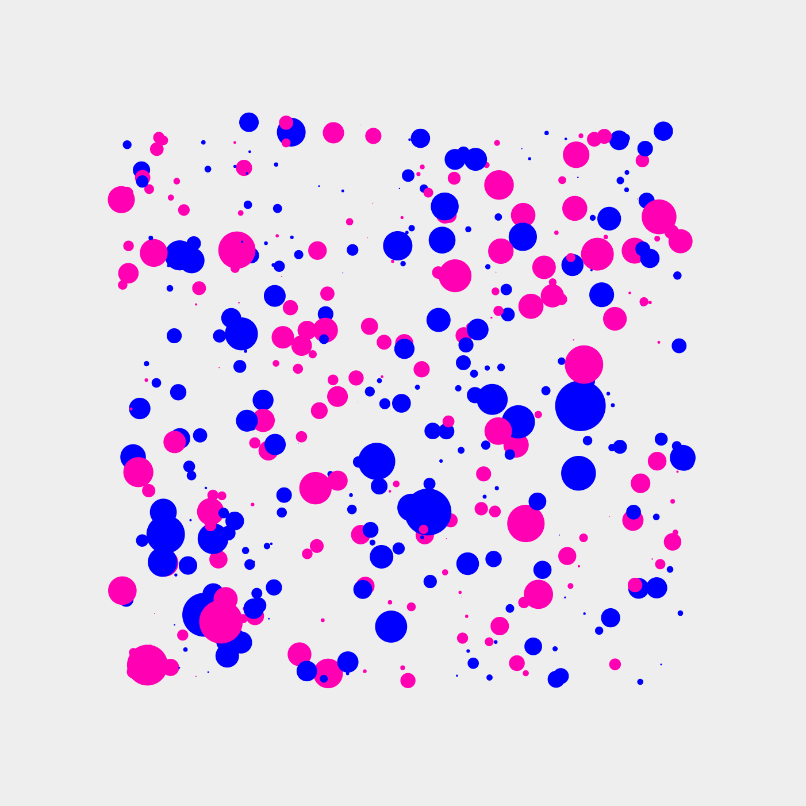

# tiny-artblocks

A starter kit for tiny and robust [ArtBlocks](https://artblocks.io/) artworks with plain vanilla JavaScript.



These tools were used to develop and deploy [Subscapes](https://github.com/mattdesl/subscapes) (which was 17kb after compression).

Features:

- A framework similar to [canvas-sketch](https://github.com/mattdesl/canvas-sketch)
- Live reload on code changes
- Strong minification/compression
- Prints minified bytes and approximate ETH deploy cost on each reload
- A robust pseudo-random number generator and hashing function (for `tokenData` seed)
  - See [PRNG](#prng) for an alternative
- Some utilities for color, math, random, and vector to get you started
- Additional function analysis, listing the byte size of the largest functions after minification
- Reports syntax errors in the browser
- A set of [Tips](./docs/tips.md) for further minification

## Install

Git clone this repo, move into it, and install its dependencies:

```sh
git clone https://github.com/mattdesl/tiny-artblocks.git

cd tiny-artblocks

npm install
```

Now you can run the scripts below.

## Usage

Run one of the following scripts in the same terminal:

#### `npm run start`

Runs a development server on [http://localhost:8081](http://localhost:8081), where changing code in `src/` (or `www/index.html`) will automatically rebuild to `www/main.min.js` and then reload the page.

Hit `Ctrl + C` to quit the development server.

#### `npm run build`

Produces a final production build to `www/main.min.js`, giving byte and ETH cost stats.

#### `npm run inspect`

Inspects the minified source code and lists the byte length of named functions, ordered by size. This is helpful to find the largest offending functions in your bundle.

It does not inspect certain closures and arrow functions.

## Source Structure

See `./src/` folder:

- `index.js` is the main entry point which sets up a canvas
- `sketch.js` is the main canvas-sketch style sketch function, which accepts a hash and returns a `render(context, width, height)` function
- `util/` is a folder that contains some example utilities (PRNG, color, math)

## Prototyping with npm and Node modules

You can also `npm install [some-module]` and then `import { foo } from 'some-module'` in your bundle, but I would only recommend doing this for prototyping. You can then copy the code manually into `util` and restructure it with ES6 and other optimizations for smaller results.

## Code Golf Tips

See [./docs/tips.md](./docs/tips.md) for a series of suggestions on how to reduce bundle size.

## PRNG

The hash function and psuedo-random number generator included in `src/` is fairly strong, and may be overkill for most ArtBlocks scripts. It uses MurmurHash to turn the `tokenData` bytes into an initial state for a permuted congruential generator (PCG).

The following suggestion by [@piterpasma](https://twitter.com/piterpasma), which uses "xorshift128" generator, may be more than sufficient for most applications and can be compressed to a far smaller output:

```js
// hash from ArtBlocks scripts
const hash = /* string from tokenData */;

// state of the PRNG
const xs_state = Uint32Array.from([0,0,0,0].map((_,i)=>parseInt(hash.substr(i*8+2,8),16)))

const prng = () => {
  /* Algorithm "xor128" from p. 5 of Marsaglia, "Xorshift RNGs" */
  let s, t = xs_state[3];
  xs_state[3] = xs_state[2];
  xs_state[2] = xs_state[1];
  xs_state[1] = s = xs_state[0];
  t ^= t << 11;
  t ^= t >>> 8;
  xs_state[0] = t ^ s ^ (s >>> 19);
  return xs_state[0] / 0x100000000;
};

// prints value in range 0..1
console.log(prng());
```

## License

MIT, see [LICENSE.md](http://github.com/mattdesl/tiny-artblocks/blob/master/LICENSE.md) for details.
